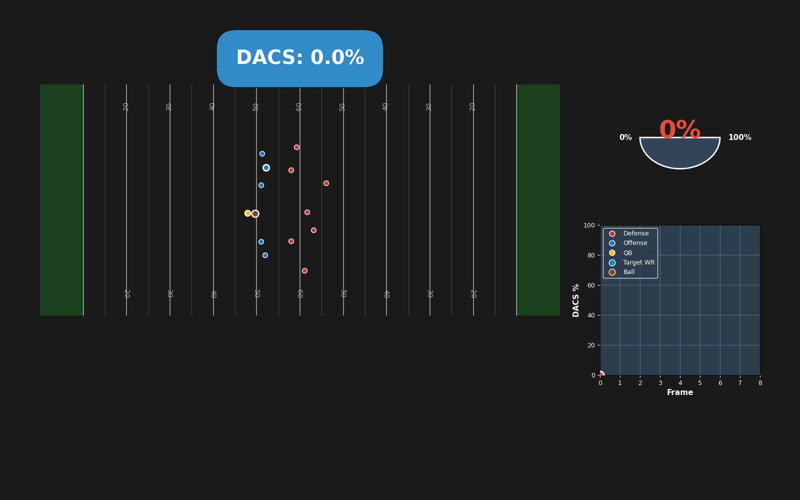

# Defensive Air Control Score (DACS)
### Big Data Bowl 2025 - University Track Submission

> **Measuring what happens after the throw: How defenders close catch zones during ball flight**

[](https://www.python.org/downloads/)
[](LICENSE)

---

## 🎯 What is DACS?

**Defensive Air Control Score (DACS)** is a frame-by-frame metric that quantifies how much of the catch zone is controllable by the defense while the ball is in flight. Unlike traditional coverage statistics that only measure outcomes (completions, incompletions, interceptions), DACS captures the **defensive process** that creates those outcomes.

### The Problem
Coverage analysis typically starts and ends at outcomes. But this approach has critical flaws:
- **Selection effects**: Elite coverage prevents throws entirely, removing those reps from evaluation
- **Outcome collapse**: An uncontested drop and a perfectly blanketed throwaway both become "incomplete" and are treated the same

### The Solution
DACS isolates the **post-throw window** (1.5-3.0 seconds after release) where defenders must:
1. Recognize the throw
2. Reorient their pursuit
3. Close the catch point before the receiver arrives

This metric answers a simple football question: *As the ball travels, is the defense actually closing the window, or is the offense simply missing?*

---

## 📊 Key Results

### Player Evaluation: "Erasers"
We identified defenders who consistently dominate catch zone control during ball flight across 9,852 passes from the 2023 NFL regular season.

**DaRon Bland** provides a compelling case study:
- His 2023 interception production was extreme (5 pick-sixes, league-leading INTs)
- But interceptions are rare and noisy
- **DACS reveals the repeatable pursuit process** underlying both INTs and high-quality incompletions
- Bland ranks **#2 in cumulative DACS contribution** among all defenders

[See the full Eraser Leaderboard →](analytics/outputs/final_visuals/viz_eraser_leaderboard.png)

### Predictive Power
Our validation model achieves **AUC = 0.76** for predicting completions using DACS features:
- High DACS at arrival strongly predicts incompletions and interceptions
- Low DACS at arrival predicts completions
- DACS separates "good incompletions" from "lucky incompletions"

### Scheme Diagnostics
DACS heatmaps reveal where defenses structurally struggle or succeed to close space by field zone, enabling:
- **Offensive game planning**: Target zones with consistently low defensive closure
- **Defensive adjustments**: Identify structural weaknesses in safety depth or pattern match rules

[See the Field Zone Heatmap →](analytics/outputs/final_visuals/viz_heatmap_max_dacs.png)

---

## 🎬 Visualizations

### Real-Time DACS in Action

We created three case study visualizations showing DACS evolution during ball flight:

<table>
<tr>
<td align="center" width="33%">
<strong>High DACS → Interception</strong><br/>
<br/>
<sub>DACS rises from 30% to 83% as defender closes catch zone</sub>
</td>
<td align="center" width="33%">
<strong>Low DACS → Completion</strong><br/>
<br/>
<sub>Sustained 0% DACS - defense never closes the window</sub>
</td>
<td align="center" width="33%">
<strong>Moderate DACS → Incomplete</strong><br/>
<br/>
<sub>Competitive battle showing contested catch zone (28% avg DACS)</sub>
</td>
</tr>
</table>

Each visualization shows:
- **All 22 players** color-coded by role (Defense: red, Offense: blue, QB: gold, Target WR: light blue)
- **Ball trajectory** in real-time (brown)
- **DACS evolution** via live meter and timeline chart
- **Frame-by-frame analysis** of catch zone control

**Video formats available**: [GIF](analytics/outputs/presentation/) | [MP4](analytics/outputs/presentation/)

---

## 📈 Core Visuals

| Visualization | Description | File |
|--------------|-------------|------|
| **DACS Process Diagram** | Complete pipeline from tracking data to DACS computation | [viz_dacs_process_diagram.png](analytics/outputs/final_visuals/viz_dacs_process_diagram.png) |
| **Eraser Leaderboard** | Top defenders by cumulative DACS contribution (2023 season) | [viz_eraser_leaderboard.png](analytics/outputs/final_visuals/viz_eraser_leaderboard.png) |
| **Case Study: Elite Air Control** | Single rep showing DACS rising during flight | [viz_case_study_eraser.png](analytics/outputs/final_visuals/viz_case_study_eraser.png) |
| **Field Zone Heatmap** | Peak DACS by depth and horizontal location | [viz_heatmap_max_dacs.png](analytics/outputs/final_visuals/viz_heatmap_max_dacs.png) |
| **DACS Evolution Chart** | How DACS changes throughout ball flight across all plays | [viz_dacs_evolution_chart.png](analytics/outputs/final_visuals/viz_dacs_evolution_chart.png) |

---

## 🔬 Methodology

### Step 1: Physics-Based Reach Model
We model each defender's reachable region during ball flight using:
- Position-specific speed and acceleration limits (99th percentile empirical values)
- Current velocity vector and momentum constraints
- Heading penalties for redirecting from current movement

This produces a time-dependent elliptical reachable region aligned with the defender's initial trajectory.

### Step 2: Machine Learning Residual Corrections
A lightweight neural network predicts scaling factors applied to the physics baseline, accounting for:
- **Orientation** relative to the catch point
- **Velocity alignment** with pursuit direction
- **Role context** (man-like proximity vs. zone spacing)
- **Reaction delays** early in ball flight

This corrects for real football situations where defenders move away from the target at release or must rotate hips before accelerating.

### Step 3: Catch Zone Definition
The catch zone is a **1-yard radius corridor** from the quarterback to the landing location (200 sampled points). This focuses evaluation on actionable space rather than irrelevant field area.

### Step 4: DACS Computation
For each frame *t* during ball flight:
1. Project each defender's reach region at time *t*
2. Mark catch zone points as controlled if inside any defender region
3. **DACS(t) = 100 × (controlled points) / (total points)**

**Interpretation**:
- DACS ≈ 0% → open window persists
- DACS ≈ 100% → catch zone effectively denied

### Step 5: Player Attribution
At the arrival frame, we compute each defender's **Player Share**:
- Drop in DACS if that defender is removed
- Restricted to defenders close enough to plausibly impact the catch zone
- Normalized to sum to 100% among eligible defenders

This enables season-long player evaluation without relying solely on interceptions or pass breakups.

---

## 💼 Applications for NFL Teams

### 1. Monday Self-Scout: The Incompletion Audit
Generate a report of all incompletions where arrival DACS is low. These are stops that look good on paper but represent:
- Busted leverage
- Late rotations
- Missed coverage assignments that were not punished

**Action**: Separate coverage success from offensive error.

### 2. Wednesday Opponent Scouting: Where to Attack
Overlay the opponent's Peak DACS heatmap with:
- Route families
- Quarterback preferences
- Down-and-distance tendencies

**Action**: Identify zones where opponents consistently fail to close space.

### 3. Friday Personnel Decisions: Range vs. Stickiness
DACS enables clean archetyping:
- **"Sticky" defenders**: Maintain high control near catch point in man-like situations
- **"Range" defenders**: Close large areas late in flight in zone structures

**Action**: Match defender profiles to scheme requirements (single-high vs. man coverage).

### 4. In-Game Feedback: Is the Window Closing?
Use DACS trends to evaluate whether specific offensive concepts repeatedly create uncloseable windows.

**Action**: Prompt coverage calls that reduce stress on defenders.

---

## 📁 Repository Structure

```
BDB_2025/
├── analytics/
│   ├── scripts/
│   │   ├── calculate_dacs.py              # Core DACS computation engine
│   │   ├── attribution.py                 # Player share attribution logic
│   │   ├── reach_model.py                 # Physics + ML reach model
│   │   └── visualize_dacs.py              # Visualization utilities
│   ├── outputs/
│   │   ├── final_visuals/                 # All publication-ready figures
│   │   ├── presentation/                  # GIF/MP4 case study videos
│   │   └── dacs_final_full/              # Complete DACS data (9,852 plays)
│   └── data/
│       ├── raw/                           # NFL tracking data (2023 season)
│       └── supplementary_data.csv         # Play outcomes and context
├── notebooks/
│   ├── validation_modeling.ipynb          # Outcome prediction validation
│   └── exploratory_analysis.ipynb         # DACS distribution and patterns
├── models/
│   └── reach_residual_model.pkl          # Trained ML residual correction model
└── README.md                              # This file
```

---

## 🚀 Getting Started

### Prerequisites
- Python 3.10+
- Required packages: `pandas`, `numpy`, `matplotlib`, `scikit-learn`, `torch`

### Installation
```bash
git clone https://github.com/yourusername/BDB_2025.git
cd BDB_2025
pip install -r requirements.txt
```

### Quick Start: Calculate DACS for a Single Play
```python
from analytics.scripts.calculate_dacs import compute_dacs

# Load tracking data for a play
play_data = load_play(game_id=2023091006, play_id=431)

# Compute DACS frame-by-frame
dacs_series = compute_dacs(play_data)

# dacs_series[0] = DACS at release
# dacs_series[-1] = DACS at arrival
```

### Generate Visualizations
```bash
# Create DACS evolution chart
python analytics/scripts/create_dacs_evolution_chart.py

# Create eraser leaderboard
python analytics/scripts/create_eraser_leaderboard.py

# Create field zone heatmap
python analytics/scripts/create_heatmap.py
```

---

## 📊 Data

This project uses NFL player tracking data from the 2023 regular season:
- **9,852 forward pass plays** with defined ball release and play end
- **10 Hz tracking** (position, speed, acceleration, heading)
- **Post-throw window**: From ball release to catch/incompletion

**Data is restricted to the post-throw window** to isolate the skill of closing and contesting space after the throw is made, rather than evaluating pre-snap leverage.

---

## 🔮 Future Work

### Planned Enhancements
1. **3D ball flight geometry**: Model arc and vertical reach for jump balls
2. **Player-specific calibration**: Individual reach profiles instead of position-based limits
3. **Coverage labeling**: Richer identification to improve context features and attribution
4. **Receiver-side metrics**: "Catch point efficiency" measuring receiver adjustment ability
5. **Real-time deployment**: Frame-by-frame DACS calculation during live games

---

## 📝 Citation

If you use DACS in your research or analysis, please cite:

```bibtex
@misc{dacs2025,
  title={Defensive Air Control Score: Quantifying Catch Zone Control During Ball Flight},
  author={[Your Name]},
  year={2025},
  howpublished={Big Data Bowl 2025 University Track Submission}
}
```

---

## 🏆 Competition

This project was submitted to the **NFL Big Data Bowl 2025 - University Track**.

**Competition Focus**: Player tracking data analysis for defensive coverage evaluation

**Key Innovation**: DACS is the first metric to quantify frame-by-frame defensive control of the catch zone during ball flight, separating repeatable pursuit skill from outcome luck.

---

## 👥 Team

[Your Name/Team Name]
[University Affiliation]
[Contact Information]

---

## 📄 License

This project is licensed under the MIT License - see the [LICENSE](LICENSE) file for details.

---

## 🙏 Acknowledgments

- **NFL Big Data Bowl** for providing player tracking data and hosting the competition
- **Next Gen Stats** for 10 Hz tracking infrastructure
- All contributors and reviewers who provided feedback on DACS methodology

---

## 📧 Contact

Questions or feedback? Reach out at [your.email@university.edu]

---

<div align="center">

**[View Full Report](REPORT.md)** | **[Explore Visualizations](analytics/outputs/final_visuals/)** | **[Watch Case Studies](analytics/outputs/presentation/)**

*Measuring the process, not just the outcome.*

</div>
